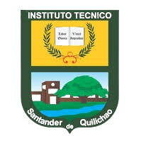

# Sitio Web Instituto Técnico

Sitio web institucional moderno de la **Institución Educativa Instituto Técnico** de Santander de Quilichao, Cauca, Colombia.

## ✨ Características

- 🎨 Diseño moderno con paleta negro/verde
- 📱 100% responsive (móvil, tablet, desktop)
- ⚡ Optimizado para rendimiento
- 🌙 Modo oscuro por defecto
- 🎬 Animaciones fluidas
- ♿ Accesible (prefers-reduced-motion)
- 🔍 SEO optimizado

## 🛠️ Tecnologías

- HTML5 semántico
- CSS3 moderno (Grid, Flexbox, variables)
- JavaScript vanilla
- Google Fonts (Inter, Space Grotesk, Instrument Serif)

